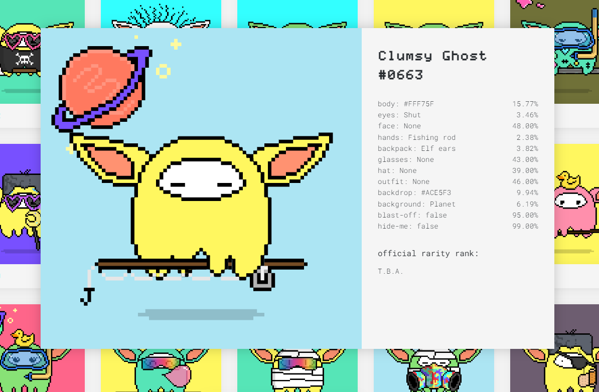

# **Sogeti Frontend Learning track**

>***This repository has been created as part of the 'Sogeti Frontend Learning track'***

&nbsp;

## **Who am I?**
Hi I'm Rens! I've been working at Sogeti as a Frontend Developer since January. Before joining the team, I studied Biology and also shortly worked in that branche. During my studies I was always very interested in visualising the things I was learning, like unique or big data sets and thinking about how to present complex information in a way that makes it easy to understand. Even though biology is a very interesting field of study, I never felt like I could really do the things that I wanted to do. I have an insatiable apppite for creativity and problem solving. To satisfy this need, I did some freelance graphic design next to my current job and picked up frontend development as a hobby. I soon realised that frontend development was the perfect combination of activities that I liked to be occupied with. That's why I decided to make a career switch and fully focus on becomming a good developer.

In my spare time I like to go bouldering, mostly indoors but If I get the chance outdoors in and around Europe. I love playing tactical boardgames, play guitar here and there and am busy setting up a NFT project that features 3D puzzle NFTs. 

&nbsp;

## **Why did I join the learning track?**
The frontend learning track for me is the ideal pathway to become a more confident and competent developer. I expect to develop a strong foundation in the core languanges of frontend development (HTML, CSS, JavaScript), get a clear understanding and learn best practices of GIT, and get a more in depth knowledge on React. I believe that a strong foundational knowledge is essential for complex problem solving, and that is really at the core of what I hope to get out of this learning track. 

&nbsp;

## **What did you learn so far?**

**Flutter / Dart**

My coding journey started out with me trying to figure out how to deploy a mobile application from start to finish. I chose Flutter & Dart for this as it seemed to be a beginner friendly framework/language. I learned how to work with VSC, Android studio and how to deploy an app to the Android Playstore. I soon ran into the limitations of flutter, and decided to continue the traditional HTML, CSS, JavaScript route.
&nbsp;

&nbsp;

**HTML/CSS/JavaScript**

After finishing the Virus application I really got hooked on coding and decided to take things more seriously. I started learning about the basics of HTML and CSS, purchased a book on JavaScript (Eloquent JavaScript) and started the Frontend learning track on Codecademy. I started to get deep into CSS and got fascinated with its complexity. I learned to work with Flexbox, Grid, responsiveness, accessibility and started to understand DOM manipulation with Javascript.
&nbsp;

**React**

My first and favorite framework I've worked with a lot is React. I was shortly introduced to class components but switched to working with functional components relatively soon. I learned all the basic React hooks and got familiar with Reacts life cycle. I then started to look into 3D web integration and got familiar with Three.js or more specifically the React variant, three-fiber. I explored multiple animation libraries such as react-spring and framer-motion. Later I got familiar with state-management with Redux, API calls with Axios, and hooking up a Firebase backend. 
&nbsp;

[bestbooks](https://bestbooks-51a67.web.app/)

&nbsp;

**Vue**

I got familiar with Vue due to a job-interview assignment. They exclusively worked with Vue so I learned Vue to build a real-estate website with their available houses API. This is where I got knowledgeable on input validation. I soon after created a website for filtering, searching & comparing collectables for an NFT project.

&nbsp;

[browseclumsys.com](https://browseclumsys.com/)

&nbsp;

**GIT**

During the 'basis opleiding' of Sogeti, I got to work side by side with another developer and learned about working together in a GIT repository. I was familiar with GIT for my own projects but never in a team. After that, to deepen my knowledge on the subject I took a course on GIT. 

&nbsp;

**SASS**

I always refrained from using many extensions / libraries as I wanted to get a  good grip on the fundamentals. But seeing how SASS is a widely used extension language I figured it would be a good idea to get familiar with it. That's why I took a course in SASS and really started to appreciate the flexibility of it. 

&nbsp;

**Web3**

My knowledge on Three.js let me to developing a NFT project that features interactive 3D NFTs ([projectgetaways.com](projectgetaways.com)). This is where I started to look into hosting applications on IPFS and how the create NFTs on a blockchain, in my case Cardano. At the moment I'm developing a 3D puzzle that you can play/solve in your crypto wallet.

&nbsp;

**Other**

Some other skills I have that are vaguely related to web development:

- Graphic Design (Adobe Photoshop, Illustrator, Indesign)
- 3D modeling / Animation (Blender)
- A bit of Unity
- Sound design (Ableton)

&nbsp;

Cheers!
